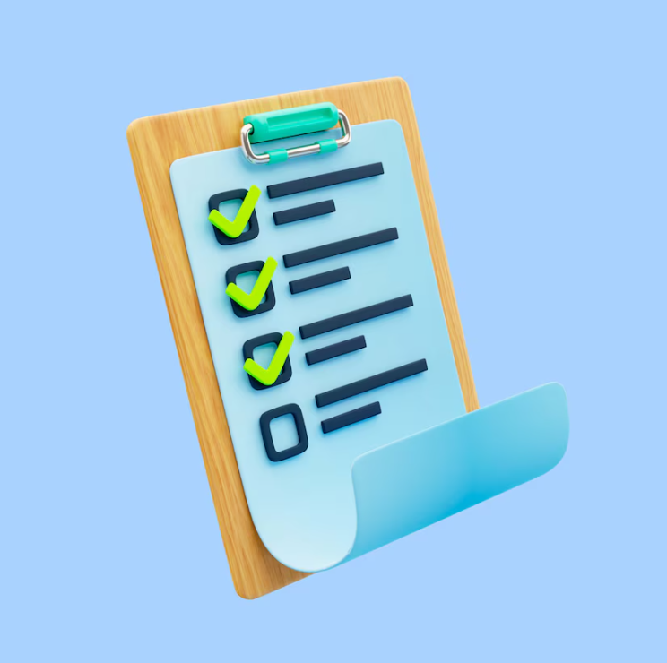

# Проект по автоматизации тестовых сценариев для сайта компании IBS

Компания IBS — бизнес- и технологический партнер лидеров российского бизнеса. Компания решает сложные задачи в сфере стратегического развития и повышения операционной эффективности, оказывая услуги в области оптимизации бизнес-процессов, создания систем управления, управления данными, анализа и моделирования, разработки, тестирования и сопровождения программного обеспечения, создания вычислительных центров и систем хранения и аутсорсинга обеспечивающих бизнес-процессов. Компания IBS была основана в 1992 году.

##  Содержание:

- <a href="#stech">Используемый стек технологий и инструментов</a>
- <a href="#check">Реализованные проверки</a>
- <a href="#engine">Запуск автотестов</a>
- <a href="#build">Сборка в Jenkins</a>
- <a href="#report">Интеграция с Allure</a>
- <a href="#testops">Интеграция с Allure TestOps</a>
- <a href="#jira">Интеграция с Jira</a>
- <a href="#telegram">Уведомления в Telegram через бота</a>
- <a href="#video">Видео отчет запуска тестов (Selenoid)</a>

<a id="stech"></a>
##  Используемый стек технологий и инструментов

| Java                                                    | IntelliJ  <br>  Idea                                            | GitHub                                                    | JUnit 5                                                   | Gradle                                                    | Selenide                                                    | Selenoid                                                    | Allure<br/>Report                                                | Allure <br> TestOps                                               | Jenkins                                                    | Jira                                                    |                                                    Telegram |
|:--------------------------------------------------------|-----------------------------------------------------------------|-----------------------------------------------------------|-----------------------------------------------------------|-----------------------------------------------------------|-------------------------------------------------------------|-------------------------------------------------------------|------------------------------------------------------------------|-------------------------------------------------------------------|------------------------------------------------------------|---------------------------------------------------------|------------------------------------------------------------:|
|  |  |  |  |  |  |  |  |  |  |  |  |

Тесты в проекте написаны на языке <code>Java</code> с использованием фреймворка  [Selenide](https://selenide.org/) и сборщика <code>Gradle</code>. <code>JUnit 5</code> задействован в качестве фреймворка модульного тестирования.
При прогоне тестов для удалённого запуска браузеров используется [Selenoid](https://aerokube.com/selenoid/).
Для удаленного запуска реализована сборка в <code>Jenkins</code> с формированием Allure-отчета и отправкой результатов в <code>Telegram</code> при помощи бота. Также реализована интеграция с <code>Allure TestOps</code> и <code>Jira</code>.

<a id="chek"></a>
##   Реализованные проверки
- Проверка открытия нужного сайта
- Проверка языка сайта
- Проверка контактов одного из филиалов компании
- Проверка гамбургер-меню сайта
- Проверка наличия строки поиска
- Проверка наличия адресов социальных сетей

<a id="engine"></a>
##  Запуск автотестов


### Запуск тестов из терминала локально:
```
gradle clean test 
```
### Запуск тестов из терминала удаленно (Selenoid):
```      
gradle clean test -Denv=main
```
### Запуск тестов c параметрами по умолчанию в Jenkins:
```
clean main test
```
### Запуск тестов c задаными параметрами в Jenkins:
```   
clean test
-DbrowserRemoteUrl=${REMOTE_URL}
-Dbrowser=${BROWSER}
-DbrowserVersion=${BROWSER_VER}
-DbrowserSize=${BROWSER_RES}
-Denv=remote
```
#### Обозначение ключей параметров:
- <code>REMOTE_URL</code> – адрес удаленного сервера, на котором будут запускаться тесты.
- <code>BROWSER</code> – браузер, в котором будут выполняться тесты. По умолчанию – <code>chrome</code>
- <code>BROWSER_VER</code> – версия браузера, в которой будут выполняться тесты. По умолчанию – <code>122.0</code>
- <code>BROWSER_RES</code> – размер окна браузера, в котором будут выполняться тесты. По умолчанию – <code>1920x1080</code>

<a id="build"></a>
##  [Сборка в Jenkins](https://jenkins.autotests.cloud/job/SH_Diploma_IBS_UI_TESTS/)

Для запуска сборки необходимо перейти в раздел **"Build with Parameters"** и нажать кнопку **"Build"**.
<p align="center">
 
</p>

После выполнения сборки, в блоке **Build History** напротив номера сборки появятся значки 
и  , при клике на которые откроются соответствующие
артефакты.

##  [Интеграция с Allure](https://jenkins.autotests.cloud/job/SH_Diploma_IBS_UI_TESTS/allure/)

<a id="report"></a>
### Allure отчет

<p align="center">   
    
</p>

### Подробнее
<p align="center">     
    
</p>       

<p align="center">     
    
</p>  

<p align="center">     
    
</p>  

##  ([https://allure.autotests.cloud/launch/39381)


<a id="testops"></a>
### Allure TestOps отчет

#### Overview

<p align="center">    

</p>

#### DashBoards
<p align="center">

</p>

#### Подробнее

<p align="center">

</p>


<a id="jira"></a>
##  [Интеграция с Jira](https://jira.autotests.cloud/browse/HOMEWORK-1240)


<p align="center">

</p>

##  [Уведомления в Telegram через бота](https://t.me/HW16Notification)


<a id="telegram"></a>
<p align="center">

</p>


<a id="video"></a>
##  [Видео отчет запуска тестов (Selenoid)](https://selenoid.autotests.cloud/video/687fa3f6a69295ac101cabe3b319a89e.mp4)
<p align="center">
  
</p>
